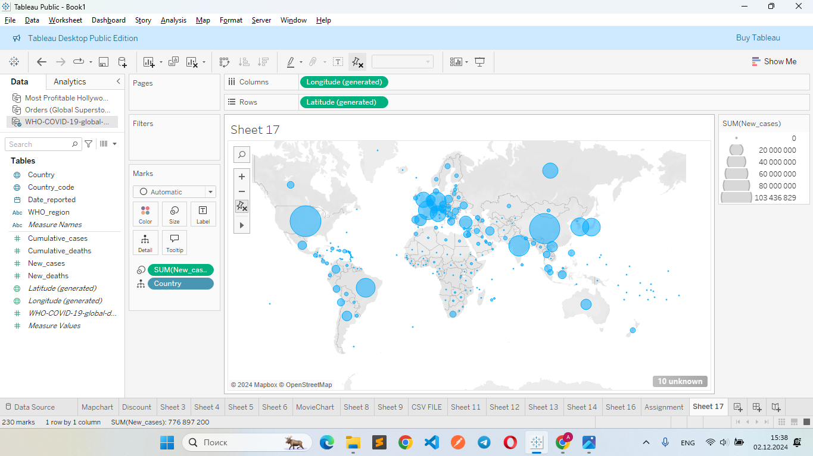

# How to work with git


### ***Refferences***
-[Github](https://gist.github.com/Jekins/2bf2d0638163f1294637)
-[Youtube](https://www.youtube.com/playlist?list=PLDyvV36pndZFHXjXuwA_NywNrVQO0aQqb)

### **Image**


\```
print("Hello Md")
\```

### Main commands
| Code | Function |
| ----------- | ----------- |
|  git init   | Initializes a new Git repository in the current directory.  |
| git status  |Displays the status of changes in the working directory (e.g., staged, unstaged, untracked files).|
| git add  | Stages changes for the next commit. |
| git commit -m "message" | Commits staged changes with a descriptive message. |
| git push | Pushes commits from the local repository to a remote repository. |

